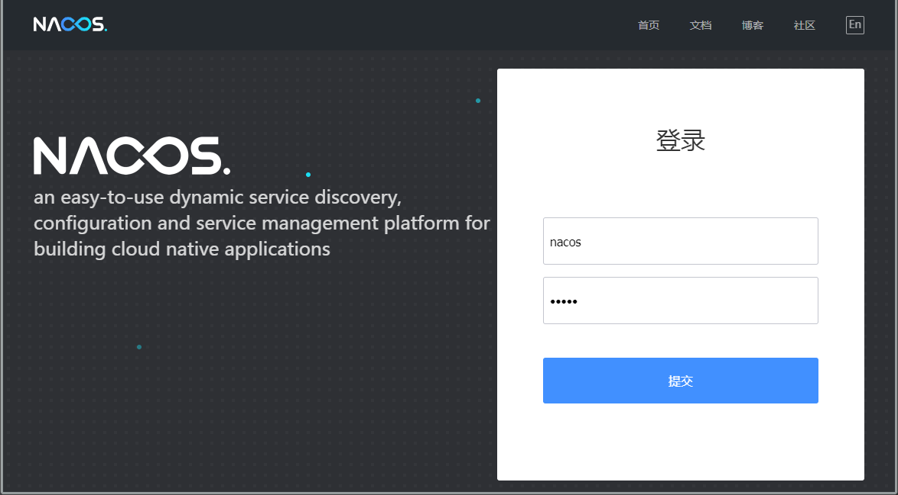
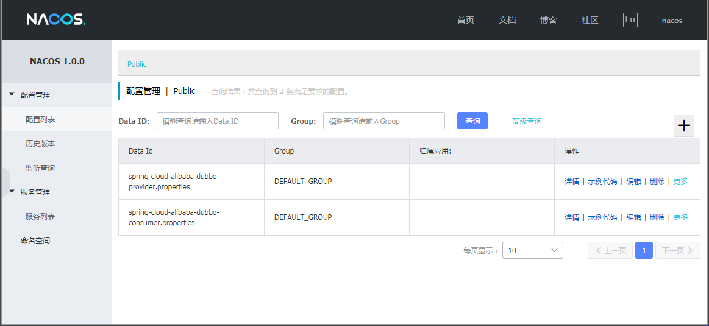
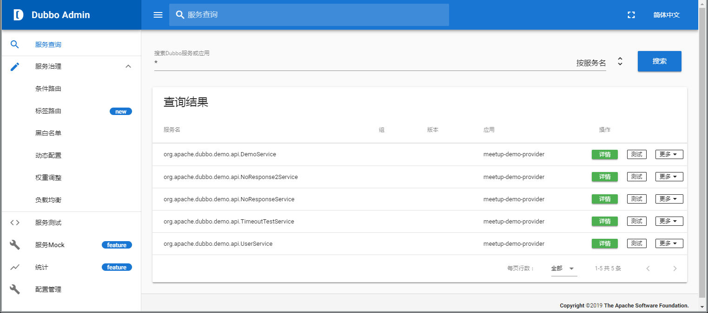
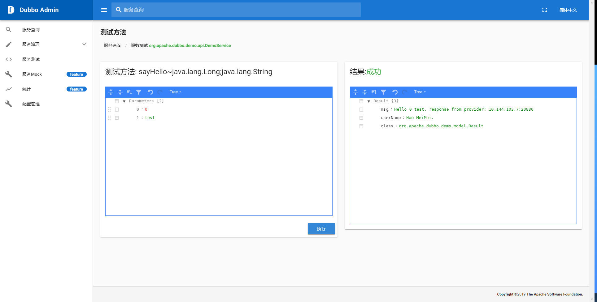
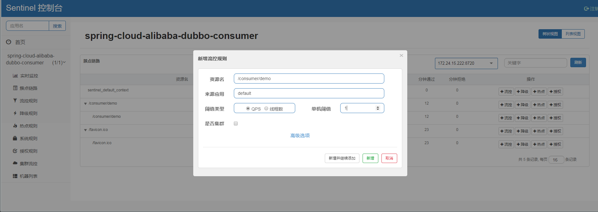
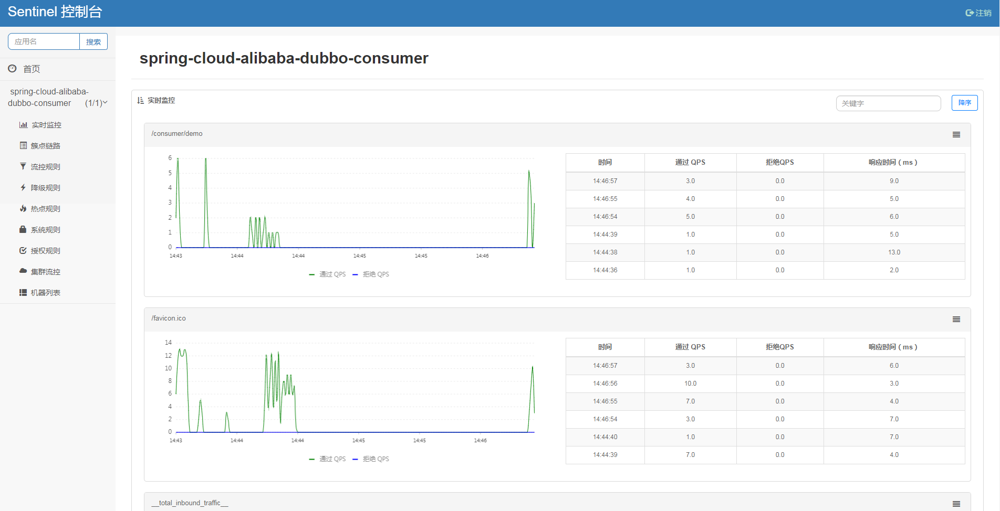
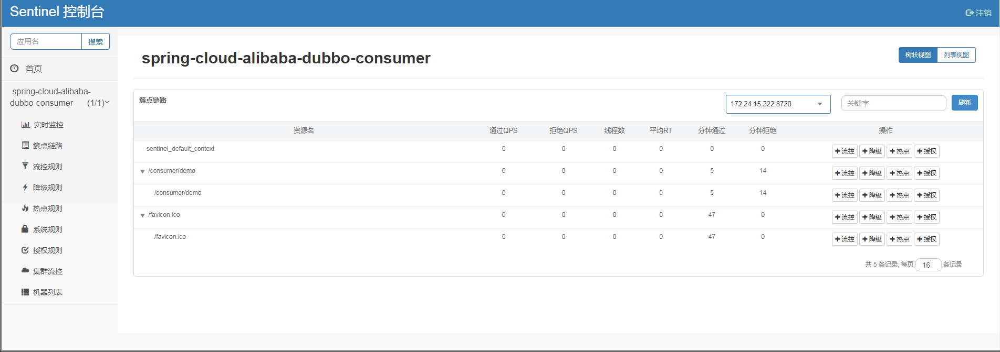

# spring-cloud-alibaba-demo

# 一、介绍

Spring Cloud Alibaba 致力于提供微服务开发的一站式解决方案。此项目包含开发分布式应用微服务的必需组件，方便开发者通过 Spring Cloud 编程模型轻松使用这些组件来开发分布式应用服务。

依托 Spring Cloud Alibaba，您只需要添加一些注解和少量配置，就可以将 Spring Cloud 应用接入阿里微服务解决方案，通过阿里中间件来迅速搭建分布式应用系统。

> 查看更多 ： https://github.com/spring-cloud-incubator/spring-cloud-alibaba

# 二、主要组件说明

编号 | 模块 | 描述 | 项目地址
----|----|----|----
1 | Spring Cloud Alibaba Nacos | 一个更易于构建云原生应用的动态服务发现、配置管理和服务管理平台。 | https://github.com/alibaba/nacos
2 | Spring Cloud Alibaba Dubbo | RPC组件 | https://github.com/apache/incubator-dubbo
3 | Spring Cloud Alibaba Sentinel | 把流量作为切入点，从流量控制、熔断降级、系统负载保护等多个维度保护服务的稳定性。 | https://github.com/alibaba/sentinel
4 | Spring Cloud Alibaba Seata | 原 Fescar，即分布式事务解决方案 | https://github.com/seata/seata

> 查看更多 ： https://github.com/spring-cloud-incubator/spring-cloud-alibaba

# 三、Spring Cloud Alibaba Nacos

## 1、简介

微服务的注册中心和配置中心。

## 2、下载

下载地址 ： https://github.com/alibaba/nacos/releases

## 3、启动



详细文档 ： https://nacos.io/zh-cn/docs/quick-start.html

## 4、增加配置信息

https://nacos.io/zh-cn/docs/quick-start-spring-cloud.html

## 5、控制台

地址 ： http://localhost:8848/nacos

帐号/密码 ： nacos/nacos

## 6、官方文档

https://nacos.io/zh-cn/docs/what-is-nacos.html

# 四、Spring Cloud Alibaba Dubbo

## 1、服务接入

```xml
<dependencies>
    <dependency>
        <groupId>cn.zhangshuzheng</groupId>
        <artifactId>spring-cloud-alibaba-dubbo-api</artifactId>
        <version>1.0.0</version>
    </dependency>
    <dependency>
        <groupId>org.springframework.boot</groupId>
        <artifactId>spring-boot-starter-web</artifactId>
    </dependency>
    <dependency>
        <groupId>org.springframework.boot</groupId>
        <artifactId>spring-boot-actuator</artifactId>
    </dependency>
    <dependency>
        <groupId>org.springframework.cloud</groupId>
        <artifactId>spring-cloud-starter-alibaba-nacos-config</artifactId>
    </dependency>
    <dependency>
        <groupId>org.springframework.cloud</groupId>
        <artifactId>spring-cloud-starter-alibaba-nacos-discovery</artifactId>
    </dependency>
    <dependency>
        <groupId>org.springframework.cloud</groupId>
        <artifactId>spring-cloud-starter-dubbo</artifactId>
    </dependency>
    <dependency>
        <groupId>org.springframework.boot</groupId>
        <artifactId>spring-boot-starter-test</artifactId>
        <scope>test</scope>
    </dependency>
</dependencies>

<dependencyManagement>
    <dependencies>
        <dependency>
            <groupId>org.springframework.cloud</groupId>
            <artifactId>spring-cloud-dependencies</artifactId>
            <version>Greenwich.RELEASE</version>
            <type>pom</type>
            <scope>import</scope>
        </dependency>
        <dependency>
            <groupId>org.springframework.cloud</groupId>
            <artifactId>spring-cloud-alibaba-dependencies</artifactId>
            <version>0.9.0.RELEASE</version>
            <type>pom</type>
            <scope>import</scope>
        </dependency>
    </dependencies>
</dependencyManagement>
```

## 2、效果图




## 3、官方文档

http://dubbo.incubator.apache.org/zh-cn/docs/user/quick-start.html

## 4、Dubbo-Admin控制台

### 4.1、下载

https://github.com/apache/incubator-dubbo-admin

### 4.2、启动

编译 ： mvn clean package

启动 ： java -jar dubbo-admin-0.1.jar --server.port=8000

### 4.3、效果图





# 五、Spring Cloud Alibaba Sentinel

## 1、下载

https://github.com/alibaba/Sentinel/releases

## 2、启动

```
java -jar "D:/Program Files/sentinel-dashboard-1.6.0.jar" --server.port=9999
```

启动参数 ： https://github.com/alibaba/Sentinel/wiki/%E5%90%AF%E5%8A%A8%E9%85%8D%E7%BD%AE%E9%A1%B9

控制台地址 ： http://localhost:9999/#/login

帐号密码 ：sentinel/sentinel

## 3、增加限流规则



## 4、服务接入

```xml
<dependency>
    <groupId>org.springframework.cloud</groupId>
    <artifactId>spring-cloud-starter-alibaba-sentinel</artifactId>
</dependency>
```

```yaml
spring:
  application:
    name: spring-cloud-alibaba-dubbo-consumer
  main:
    allow-bean-definition-overriding: true
  cloud:
    nacos:
      discovery:
        server-addr: 127.0.0.1:8848
      config:
        server-addr: 127.0.0.1:8848
    sentinel:
      transport:
        dashboard: localhost:9999

server:
  port: 8090

dubbo:
  scan:
    base-packages: cn.zhangshuzheng.spring.cloud.alibaba.dubbo.consumer.dubbo
  protocol:
    name: dubbo
    port: -1
  registry:
    address: spring-cloud://localhost

management:
  endpoints:
    web:
      exposure:
        include: '*'
```

## 5、效果图





## 6、官方文档

https://github.com/alibaba/Sentinel/wiki

# 六、Spring Cloud Alibaba Seata

## 1、下载

https://github.com/seata/seata/releases

## 2、初始化

创建依赖数据表

```sql
CREATE TABLE `undo_log` (
  `id` bigint(20) NOT NULL AUTO_INCREMENT,
  `branch_id` bigint(20) NOT NULL,
  `xid` varchar(100) NOT NULL,
  `rollback_info` longblob NOT NULL,
  `log_status` int(11) NOT NULL,
  `log_created` datetime NOT NULL,
  `log_modified` datetime NOT NULL,
  `ext` varchar(100) DEFAULT NULL,
  PRIMARY KEY (`id`),
  UNIQUE KEY `ux_undo_log` (`xid`,`branch_id`)
) ENGINE=InnoDB AUTO_INCREMENT=1 DEFAULT CHARSET=utf8;
```

## 3、启动

https://github.com/seata/seata/wiki/Quick-Start

## 4、接入

```xml
<dependency>
    <groupId>org.springframework.cloud</groupId>
    <artifactId>spring-cloud-alibaba-seata</artifactId>
</dependency>
```

```java
@Configuration
public class FescarConfig {
    @Bean
    public GlobalTransactionScanner globalTransactionScanner(){
        return new GlobalTransactionScanner("dubbo-gts-fescar-example", "my_test_tx_group");
    }
}
```

```java
@Reference(version = "1.0.0")
private StorageDubboService storageDubboService;

@Reference(version = "1.0.0")
private OrderDubboService orderDubboService;
 
@GlobalTransactional(timeoutMills = 300000, name = "dubbo-gts-fescar-example")
public ObjectResponse handleBusiness(BusinessDTO businessDTO) {
	//1、扣减库存
	ObjectResponse storageResponse = storageDubboService.decreaseStorage(commodityDTO);
	//2、创建订单
	ObjectResponse<OrderDTO> response = orderDubboService.createOrder(orderDTO);
	return objectResponse;
}
```

## 5、官方文档

https://github.com/seata/seata/

## 6、常见错误

windows下启动提示“输入行太长”，可修改seata-server.bat文件内set CLASSPATH="%BASEDIR%"\conf;"%REPO%"\*

## 7、参考示例

https://github.com/spring-cloud-incubator/spring-cloud-alibaba/blob/master/spring-cloud-alibaba-examples/seata-example/readme-zh.md

# 七、演示源码

## 1、Github

https://github.com/shuzheng/spring-cloud-alibaba

## 2、Gitee

https://gitee.com/shuzheng/spring-cloud-alibaba


